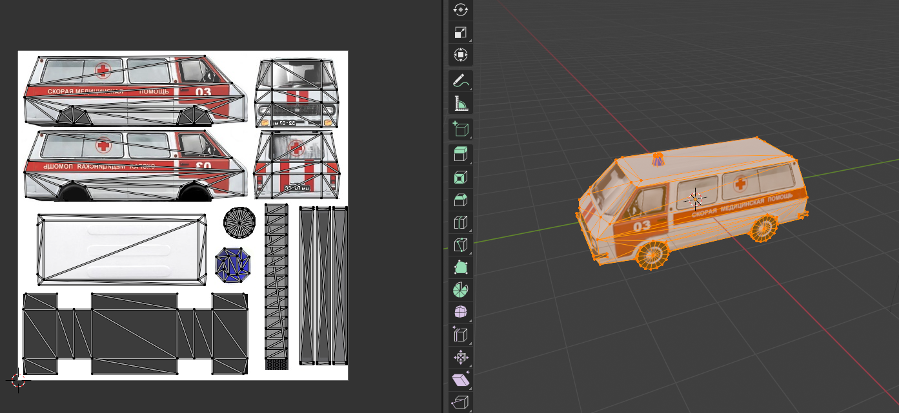
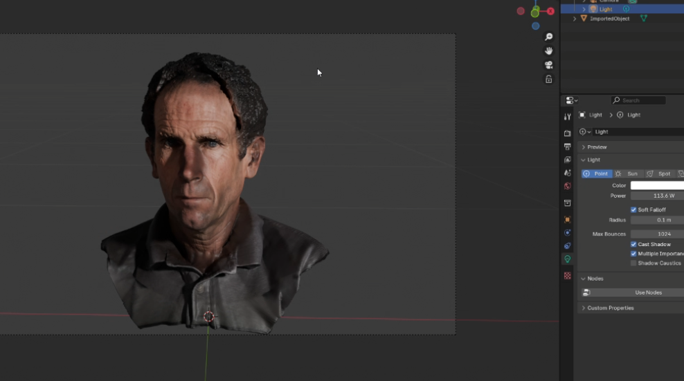

OpenCTM (.ctm) Blender
====================

This Blender plugin (add-on) allows you to import/export files in OpenCTM file format.

***For Blender 4.2 and up***

## What it imports:
- Meshdata
- UV Coordinates
- Color Data (attributemap with name 'Color' with data RGBA)

## What it exports:
- Meshdata
- UV Coordinates
- Normals
- Color Data (attributemap with name 'Color' with data RGBA)

## Install
- Blender > Edit > Preferences > Add-Ons > Install from disk > .zip file

## Usage

- Download from the release tags here on [GitHub](https://github.com/RealIndrit/blender-openctm/releases/latest)
- To import: File > Import > OpenCTM (.ctm)


## Showcase




**Note** Some probles that might occur
- Normals might be flipped, fix it by force a recalculate normals in Blender.


## Dev notes

Blender 4.2.0 uses python 3.11 specifically, so use that to install bpy and create a virtualenv for if you want to have IDE autocompletions and such:
```
python3.11 -m venv venv
venv/bin/pip install bpy blender-stubs
```

Build the addon .zip file:
```
blender --command extension build
```

Install dev build:
* Blender > Edit > Preferences > Add-Ons > Install from disk > .zip file

# Disclaimer

Plugin prepackages OpenCTM.dll (df04ff1b749e0c66ad72882cc9bccf01 MD5) lib. If you do not trust this file (it is unmodified).
You are free to get your own at [sourceforge](https://sourceforge.net/projects/openctm/)
or compile [source](https://github.com/Danny02/OpenCTM) yourself

# Credits

Some credits to the repos/developer that gave me inspiration/head-start by doing most heavy lifting for me.
- [lejafar](https://github.com/lejafar/Python-OpenCTM)
- [Danny02](https://github.com/Danny02/OpenCTM/)
- [Marcus Geelnard](https://sourceforge.net/u/marcus256/)