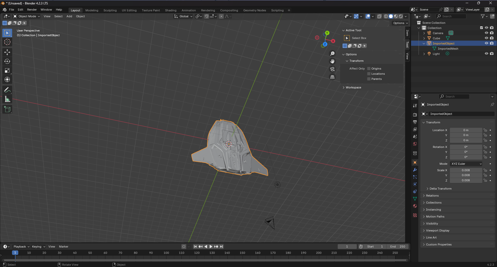

Import OpenCTM (.ctm)
====================

This Blender plugin (add-on) allows you to import files in OpenCTM format.




## Usage

- To import: File > Import > OpenCTM (.ctm)

**Note** Model might be scaled in weird way when imported, make sure to scale it to viewport size after importing it, 
also normals might be scuffed, fix it by force a recalculate normals in Blender.


## Dev notes

Blender 4.2.0 uses python 3.11 specifically, so use that to install bpy and create a virtualenv for if you want to have IDE autocompletions and such:
```
python3.11 -m venv venv
venv/bin/pip install bpy blender-stubs
```

Build the addon .zip file:
```
blender --command extension build
```

Install dev build:
* Blender > Edit > Preferences > Add-Ons > Install from disk > .zip file

# Disclaimer

Plugin prepackages OpenCTM.dll (df04ff1b749e0c66ad72882cc9bccf01 MD5) lib. If you do not trust this file (it is unmodified).
You are free to get your own at [sourceforge](https://sourceforge.net/projects/openctm/)
or compile [source](https://github.com/Danny02/OpenCTM) yourself 